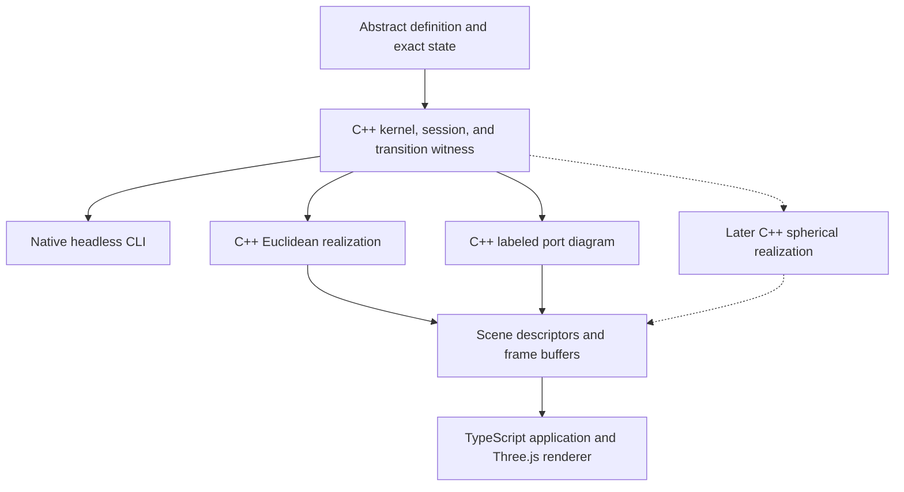

# Twisty Puzzle Simulator Architecture

**Revised architecture proposal and implementation plan | 8 October 2026**

*An abstract rule system with interchangeable geometric realizations*

This proposal combines the abstract architecture with the agreed implementation plan. C++20 implements the abstract core, compiler, sessions, and geometric interpreter. A TypeScript application uses Three.js to render C++ scene and frame data, with the C++ components compiled to WebAssembly for the browser and to native code for a headless CLI. Interfaces below remain contract pseudocode; the implementation languages and first-release decisions are fixed.

## 1. Architecture and scope

The simulator has two kinds of puzzle data: an **abstract definition** that determines every legal state change, and a **realization definition** that interprets states and transitions in an ambient space. One abstract puzzle can have several realizations and several renderer implementations.

A piece is an identity with an abstract placement. A position is an address in a placement domain. A twist is a directed, possibly partial operation. None requires coordinates, a mesh, an axis, a metric, or a continuous angle.



| Component | Owns | Does not own |
| --- | --- | --- |
| Abstract model | Pieces, placements, constraints, operations, goals, symmetry | Meshes, matrices, axes, collision geometry |
| Realization | Visual parts, placement interpretation, animation, interaction bindings | Move legality or puzzle state mutation |
| Renderer | Ambient geometry, projection, drawing, picking, GPU resources | Puzzle rules or move selection |

**Boundary rule:** a legal abstract transition remains legal when the realization changes. A geometry mismatch is a realization defect or an explicitly unsupported visual case, rather than a change to the puzzle rules.

Scope: rigid or combinatorial twisty puzzles with exact discrete resting states. Continuous animation is separate. A later extension can introduce exact continuous logical parameters, but doing so requires a suitable state algebra and legality procedures.

### 1.1 Implementation and delivery

The first delivery targets are a browser application and a native headless CLI. Build the C++20 modules with CMake and Ninja. Use Emscripten to produce a modularized WebAssembly ES module with Embind bindings and generated TypeScript declarations. The native and WebAssembly builds use the same rule, compiler, session, and geometric-interpreter sources.

Build the browser application with TypeScript, React, and Vite. Three.js owns drawing, camera projection, raycasting, lighting, and GPU resources. C++ owns puzzle geometry, placement transforms, animation paths, and the interpretation of picked visual parts. Browser UI code does not duplicate puzzle rules or geometric realization logic.

Run WebAssembly on the browser's main thread initially. Deliver static browser assets and a native CLI; a backend service, desktop wrapper, and threading are outside the first release. Add workers when measured compiler or analysis workloads justify the extra synchronization.

### 1.2 First-release audience and scope

The first release serves puzzle authors and researchers. Prioritize inspectable definitions, structured blocking explanations, portable regression fixtures, and reproducible execution.

Support a standard 3x3 cube and a reference bandaged variant with one fused edge-corner pair. Each has a Euclidean realization and a flat labeled port diagram, synchronized against one session. Section 9 specifies their logical and visual scope.

Authors edit versioned JSON files and run the compiler through the CLI or browser file import. The browser supplies a definition inspector and diagnostics. An in-browser text editor and graphical authoring tools are later work.

The first release also includes notation playback, seeded legal scrambles, undo/redo, save/load, replay, operation controls, animation controls, and cross-view piece highlighting. Jumbling, spherical realizations, Bagua, solvers, branching history, and shared sessions follow the release gates in Section 12.

## 2. Abstract definitions and state

Keep definitions immutable and states small. The definition stores reusable structure; a state stores the placement of each persistent piece and any additional mechanism variables. Reachable configurations are generated by operations; the definition does not enumerate the configuration graph.

```text
AbstractPuzzleDefinition {
  puzzleId; schemaVersion; semanticsVersion;
  pieceTypes; pieces;
  placementDomains;
  relations; constraints;
  operations;
  symmetry;
  initialState; goal;
}

PuzzleState {
  placementOf: PieceId -> PlacementKey;
  mechanism: ExactRecord;
}
```

### Placement means the full abstract location and orientation

For an ordinary orbit, a placement can be a pair (slotId, orientationId). For a puzzle with irregular placements, it can be an opaque key supplied by a domain implementation. A piece type declares which placement domain it uses. Domain operations provide equality, canonicalization, serialization, and the abstract relations needed by the rules.

| Entity | Meaning |
| --- | --- |
| PieceType | Shared structural signature and allowed placement domain. Geometry belongs to the realization. |
| PieceInstance | Stable identity, type, home placement, and any symbolic labels relevant to goals or constraints. |
| PlacementDomain | Effective set of full abstract placements. It may be a finite table or a symbolic algebra. |
| Mechanism variables | Exact hidden modes, coupling phases, or other data not recoverable from piece placements. |
| Goal | Predicate on abstract states. It can ignore selected orientations or accept a symmetry orbit of target states. |

### One authoritative state

Use piece-to-placement as the authoritative mapping. Maintain occupant-by-slot, footprints, and relation indexes as derived caches. Update caches transactionally with the state; exclude them from semantic equality and save-file identity.

A valid state satisfies type compatibility, occupancy and capacity rules, rigid-component rules, and other declared constraints. A valid assignment need not be reachable from the initial state. The kernel guarantees reachability for states produced by legal moves, without requiring a complete reachability test for arbitrary imported assignments.

All logical equality and hashing use canonical exact values. Renderer matrices, rounding tolerances, easing curves, and camera transforms never enter the state hash.

The C++ implementation starts with finite placement domains, exact orientation transports, and registered abstract rule modules. Definition and transition objects are immutable after construction; realizations receive read-only access. The placement-domain interface leaves room for later symbolic implementations without promising them in the first release.

## 3. Positions, ports, and occupancy

Provide a simple finite slot implementation first, while keeping the placement interface general. Positions have no geometric meaning; the same address may map to a cubie frame, a spherical patch, or an abstract graph node.

### Abstract ports preserve internal information

A type may contain a finite set of local ports or markers. A placement tells where those ports are attached in the abstract structure. Three distinct ports on a corner encode its orientation without referring to any coordinate frame. The realization can map a port to a sticker, material patch, or one of several visual fragments.

```text
PlacementDescriptor {
  key: PlacementKey;
  anchor: PositionId;             // optional
  orientation: OrientationKey;   // optional
  footprint: Set<CellId>;         // optional
  portAttachment: PortId -> AttachmentId;
}

PieceType {
  id;
  placementDomainId;
  localPorts;
  structuralAttributes;
}
```

### Slots and cells serve different purposes

A slot is a convenient named anchor. A cell is an abstract occupancy unit. A large or bandaged piece may occupy several cells. Orientation can change port attachments without changing occupied cells. Avoid forcing the two concepts to be identical.

For a finite partition model, a placement q has a footprint F(q). The constraints can state that different pieces have disjoint footprints, or that each cell has a specified capacity. Nothing requires a cell to be a voxel, polygon, or physical region.

### A useful generic blocking rule

Let C be a selected set of abstract cells for an operation. A rigid piece can participate when F(q) is contained in C, and remain stationary when F(q) is disjoint from C. A nonempty partial overlap blocks that operation in this rule family. Coupled components must obey a common participation rule.

This is a useful backend for many bandaging models and some finite jumbling models. It is not a claim that every jumbling puzzle admits one finite universal cell partition. Rules that do not fit it use placement relations or a dedicated exact rule module.

### Keep observable equivalence separate

Two mechanical placements may look identical in a plain-color realization but differ in a marked realization or in their later behavior. Keep the information required by future moves. A goal predicate or visual binding may ignore it. Quotient placements only after verifying that the quotient preserves every operation and constraint.

## 4. Symmetry and compact authoring

The structural symmetry group G is an abstract automorphism group. Supply an effective action on positions, placements, operation names, relations, and, where appropriate, piece identities. Its definition does not require a representation in a Euclidean rotation group.

### Generate homogeneous domains from stabilizers

For a transitive position family, choose a representative x and its stabilizer H. The positions are the coset set G/H. Supply H through generators or an explicit subgroup representation. A finite-group compiler can enumerate the cosets and assign dense runtime indexes.

| Cube position family | Stabilizer | Number of positions |
| --- | --- | --- |
| Face positions | C4 | 24 / 4 = 6 |
| Edge positions | C2 | 24 / 2 = 12 |
| Corner positions | C3 | 24 / 3 = 8 |

Oriented placements can sometimes be represented by $G/K$, where $K \le H$. The map $G/K \to G/H$ forgets orientation; its fiber is the coset set $H/K$. The set $H/K$ is a quotient group only when $K$ is normal in $H$. For more general puzzles, use explicit fibers or placement domains instead.

### Generate move families and their guards together

Given a representative operation $m$, a symmetry $g$ produces $m_g = gmg^{-1}$ as an operation on states. Its guard, participation rule, and update must all transform. The required conditions are:

$$
\operatorname{legal}(m,s) \iff \operatorname{legal}(m_g,gs),
$$

$$
m_g(gs)=g\,m(s).
$$

The generated move family may itself be represented by a coset domain using the stabilizer of the complete operation specification. An operation with direction or special participation data may have a smaller stabilizer than its named anchor.

### Keep three notions of orbit distinct

A structural symmetry orbit, an orbit under legal moves, and a family sharing a visual mesh are different concepts. Their coincidence in a simple puzzle is a convenience, not a required invariant.

### Source descriptions and compiled definitions

Let authors write group generators, subgroup generators, prototype pieces, prototype operations, and small relation tables. Compile these into indexed arrays, bitsets, orientation tables, and generated guards. Preserve readable source addresses for diagnostics. A puzzle with little symmetry can use the trivial group and explicit definitions.

A group presentation alone is insufficient for computation. Finite permutation groups have concrete algorithms; symbolic infinite domains must supply effective equality and action procedures. Do not promise a generic solver for arbitrary group presentations.

The first-release C++ compiler accepts concrete finite permutation-group generators, subgroup generators, prototypes, and explicit tables. Validate generated actions and subgroup membership, bound enumeration, and return source-linked diagnostics when a declared limit is exceeded. Generate directed operations and their guards together. Explicit and prototype-authored reference cubes must compile to the same canonical semantic definition, with authoring provenance stored separately.

## 5. Directed operations and transitions

A primitive operation m is a partial bijection from D_m to R_m within the valid state space. Its declared inverse maps R_m back to D_m. The kernel evaluates only abstract data. A move request names a directed primitive and exact parameters supported by that primitive.

```text
MoveRequest {
  operation: DirectedOperationKey;
  parameters: ExactRecord;
}

RuleEngine {
  plan(definition, state, request)
    -> Blocked | AbstractTransition;
  validateState(definition, state) -> Diagnostics;
}

AbstractTransition {
  definitionDigest;
  beforeStateDigest; afterStateDigest;
  request: MoveRequest;
  pieceActions: PieceAction[];
  mechanismChanges;
  afterState;
}

PieceAction {
  pieceId;
  from: PlacementKey; to: PlacementKey;
  role: AbstractRoleId;
  transport: AbstractTransportKey;
}
```

### The transition is a witness, not only a state diff

Include all participants, including those whose stored placement is unchanged. A visually featureless center can rotate while its visible state remains the same. Transport and role are abstract identifiers: they contain no axis, angle in radians, matrix, or curve.

Retain the directed operation and its exact parameters. Two operations can have the same endpoint effect but different domains, participation, or intended visual routes. An endpoint permutation therefore does not determine the animation.

### Planning is pure and committing is transactional

Planning checks the guard, determines participants, computes their updates, updates mechanism variables, and checks the declared postconditions. A blocked result includes an abstract reason code and relevant piece or relation IDs. The session commits the complete result once, against the expected state revision.

Expose planning as a pure C++ operation over an immutable definition and source state. `PuzzleSession.execute(request, expectedRevision)` performs planning and atomic commit. A blocked request or stale revision leaves the authoritative state, revision, and history unchanged. The public realization API exposes no state setters or commit methods.

### Primitive paths versus powers

A sequence of n primitive operations is legal only if each intermediate application is legal. A separately declared long operation can have different semantics. Keep R2 as either an explicit primitive or a specified composition. Avoid reducing a path by its endpoint permutation when legality or animation depends on the path.

For the first-release cube definitions, declare clockwise and counterclockwise quarter-turn primitives. Half-turn notation such as `R2` expands to two checked quarter-turn primitives. Do not combine that sequence into one endpoint permutation before planning or rendering it.

A solver can discard animation-only transport information when comparing states, but replay and rendering retain the operation witness. An inverse transition restores the full logical state, including hidden mechanism variables.

## 6. State dependent rules and jumbling

An abstract kernel can express jumbling, but compact symmetry data does not determine the blocking rules by itself. Those rules require additional combinatorial structure or an effective rule module. This work belongs to puzzle authoring and compilation.

| Rule backend | Representation | Good fit |
| --- | --- | --- |
| Permutation and orientation | Indexed slot permutations and orientation transports | Ordinary finite orbit puzzles |
| Finite footprints | Placements occupy cell sets; moves act on selected cells | Bandaging and compatible finite irregular models |
| Placement relations | Tables or predicates for participation, compatibility, and blocking | Finite jumbling catalogs and mechanism modes |
| Symbolic domains | Exact symbolic placement keys with effective operations and relations | Models where global placement enumeration is unsuitable |

### Useful abstract predicates

```text
participates(pieceId, placement, operation, mechanism)
transport(placement, operation, role) -> PlacementKey
blocks(placement, operation, mechanism) -> Reason?
compatible(pieceId, newPlacement, state) -> Bool
enabled(operation, mechanism) -> Bool
```

Relations may be indexed by placement type and operation family, then expanded through symmetry. Keep them reusable: a relation can return the IDs of the pieces responsible for a blocked move, enabling the realization to highlight them.

### A finite example

Suppose an abstract piece occupies {a,b}. A move selects {a,c}. The footprint overlaps the selection without being contained in it, so the piece blocks the move. If another legal operation transports its footprint to {a,c}, this piece becomes a full participant. The move can then proceed if its remaining guards hold. No geometric coordinates are involved.

### Geometry assisted authoring

An authoring tool may inspect a reference solid or mechanism to derive placement tables and blocking relations. Its output is an abstract definition plus a reference realization. Freeze the abstract rules under a semantic version. Other realizations bind to that definition; they do not recompute a different legal move set.

Geometry-based generation requires coverage and verification. Sampling a few states does not prove that a finite catalog is complete. A symbolic extension must provide exact identity, transition, and legality procedures. Neither the existence of symmetry nor the use of symbolic keys solves these issues automatically.

### Keep the first implementation scoped

Start with finite placement domains and registered abstract predicates. The first release implements permutation/orientation and finite-footprint rules using the reference cube and bandaged variant. Placement-relation catalogs and symbolic domains remain extension points.

After the first release, independently review the exact rule model and fixtures for one real jumbling puzzle before integrating it. Introduce symbolic domains only when that example demonstrates a concrete need; preserve the interface boundary from the beginning. The finite bandaged fixture does not establish a general jumbling model.

## 7. Geometric realization contracts

A realization interprets one versioned abstract puzzle in a particular ambient space. It binds stable abstract identities to reusable visual assets and turns abstract transitions into motion. It never mutates a PuzzleState or decides legality.

```text
PuzzleRealization<Scene, Frame> {
  id; compatibleDefinitionDigest;
  requiredCapabilities;
  buildScene(definition, state) -> Scene;
  prepareAnimation(definition, before, transition)
    -> Animation<Frame>;
  bindHit(hit, displayedFrame) -> InteractionTarget;
}

Animation<Frame> {
  sample(progress01) -> Frame;
  durationHint;
}
```

### Endpoint agreement

Write $F_r(s)$ for the realized scene of state $s$ and $\gamma_r(e,t)$ for an abstract transition $e:s\to s'$. Require

$$
\gamma_r(e,0)=F_r(s),\qquad \gamma_r(e,1)=F_r(s')
$$

in the renderer's scene semantics, up to the declared numerical tolerance and stable asset identities.

A realization may conceal logical distinctions, so F_r need not be injective. A plain-color realization and a marked realization can share a mechanical core while revealing different amounts of its state.

For the first-release realizations, use a geometric endpoint tolerance of `1e-6` in normalized puzzle units. Compare realized geometry and stable bindings in scene semantics, accounting for declared asset symmetries. A featureless center can return to an equivalent square pose without retaining a logical center orientation. Exact logical comparisons never use this tolerance.

### A piece can have several visual parts

Bind (PieceId, PortId, VisualPartId) to visual objects. One logical corner can be a single Euclidean body or several patches on a spherical surface. A visual part keeps stable identity through the transition, even when it changes parent transform or chart.

A position-to-matrix table is a convenient optimization for rigid Euclidean realizations. The C++ interpreter constructs these transforms and their motion tracks. The general contract must also support a placement-to-collection-of-objects interpretation. A single global matrix need not describe a multipart piece in every realization.

### Symmetry representations are optional

A symmetric realization may supply a homomorphism rho_r from the abstract structural symmetry group to ambient transformations. Equivariance requires F_r(g.s) = rho_r(g).F_r(s), with any declared relabeling of visual parts. An asymmetric shape modification can implement the same puzzle without this equivariance.

### Physical fidelity is a realization property

Classify a realization as diagrammatic or as a physical mechanism model. The latter needs additional evidence that legal abstract operations admit its claimed geometric motion. Collision checks can verify that claim or identify an invalid realization. They do not silently alter the core guard.

An explicitly partial realization may report UnsupportedTransition. This is separate from Blocked and must be presented as a visual limitation. A total realization covers every legal transition in its declared abstract scope.

## 8. Ambient spaces and renderers

The realization and the renderer are separate extensions. The realization knows how this puzzle maps to geometry; the renderer knows how to draw supported geometric objects. The same realization may have several rendering implementations.

| Ambient geometry | Natural transform representation | Renderer responsibilities |
| --- | --- | --- |
| Euclidean R3 | Affine 4 x 4 matrices or rigid transforms | Meshes, normals, camera, depth, picking |
| Sphere S2 | SO(3) acting on points and patches | Spherical regions, projection, surface picking |
| Sphere S3 | SO(4) acting in R4 | Charts, projection, geometric traversal |
| Hyperbolic H3 | Lorentz transformations in a hyperboloid model | Model-specific projection and traversal |

These representations are examples, not fields of the abstract puzzle. Each ambient backend defines its primitive types, transformation operations, and projection semantics. A renderer declares capabilities instead of accepting geometry it cannot interpret.

The first-release Three.js adapter supports triangle meshes, material bindings, generic labels, rigid transforms, and flat diagram geometry in R3. A later S2 realization can supply tessellated surface patches and their C++ motion tracks through the same adapter where its capabilities suffice. S3 and H3 require separate geometry and projection designs; the initial adapter does not promise them.

```text
Renderer<Scene, Frame> {
  capabilities;
  prepare(scene, assets) -> RenderResources;
  draw(resources, frame, camera, viewport);
  pick(resources, frame, camera, screenPoint) -> Hit?;
}

InteractionTarget {
  pieceId?; portId?;
  operationCandidates?;
}
```

### Geometry chooses a request; the core validates it

Picking produces a visual object and local hit data. The realization maps that result to an abstract identity and optional operation candidates. An input controller converts a click, drag, or keyboard command into a directed abstract MoveRequest. Only the rule engine returns Legal or Blocked.

Camera rotation changes the view. Relabeling an abstract frame or applying a whole-puzzle operation changes abstract data according to its declared semantics. Keep these actions distinct even if their animations look similar.

For the initial interaction model, provide camera orbit controls, click selection, operation buttons, and keyboard/notation commands. Pass the picked visual-part identity and local hit data, tagged with the displayed frame, to the C++ realization. Its binding returns abstract identities and candidate requests; the application selects a request and submits it to the session. Three.js raycasting does not select or validate puzzle moves.

### Boundaries for performance

Compile asset bindings once. Reuse meshes or spherical patch templates; update transforms and material bindings per frame. Frame sampling is pure and should avoid allocations in the hot path. For a finite placement domain, cache visual interpretations by realization ID and PlacementKey.

A render resource cache is disposable. A geometry or GPU failure can cause visual reconstruction from the authoritative state and operation history. It cannot corrupt the logical state.

### 8.1 C++ to Three.js bridge

Keep the renderer bridge independent of puzzle-specific C++ types. Its public contracts are:

```text
SceneDescriptor {
  sceneId; realizationId; definitionDigest; requiredCapabilities;
  meshAssets; materialBindings;
  visualParts: VisualPartBinding[];
  labels;
}

VisualPartBinding {
  visualPartId; pieceId; portId?;
  meshAssetId; materialBindingId;
}

FrameBuffer {
  sceneId; frameId; transitionId?; progress01;
  transforms; appearanceUpdates;
}

Hit {
  sceneId; displayedFrameId; visualPartId;
  localPoint; localNormal?;
}
```

C++ generates reusable mesh assets and samples animations into reusable buffers. Export positions and normals as Float32 arrays, indices as Uint32 arrays, and object transforms as column-major 4x4 matrices. Internal geometric calculations may use double precision. Stable symbolic identities cross the API boundary; renderer lookup indexes are disposable.

The presentation controller tags displayed frames with frame IDs and associates them with their scene and sampled data. A hit is interpreted against that displayed frame, rather than a newer session state. Frame tags are presentation metadata; they do not affect pure geometric sampling or logical digests.

Use Emscripten's modularized ES-module factory, Embind, and generated TypeScript declarations. A thin TypeScript wrapper explicitly disposes C++ handles. Copy each exported WASM memory view immediately into JavaScript-owned storage before another call can grow memory or invalidate its source. Copy static assets once and reuse destination arrays for frame updates; do not retain WASM heap views across calls or serialize frames as JSON.

Three.js constructs `BufferGeometry` from the copied assets, reuses mesh instances and material resources, and applies sampled frame data. It owns GPU uploads and picking. It does not reconstruct placement transforms, infer twist axes, or implement motion paths. Application selection and blocking feedback can apply generic appearance overrides using stable piece and part bindings.

Manage obsolete Three.js geometries, materials, textures, and controls with explicit disposal. Rebuild presentation resources after view replacement or GPU failure using the session's immutable records. The binding wrapper and renderer have separate, explicit resource lifetimes.

## 9. First-release puzzles and realizations

Define the abstract 3x3 cube once: eight corner positions with three orientations, twelve edge positions with two orientations, six featureless center pieces, and six face-related move families with directed quarter-turn primitives. The first-release centers have unchanged logical placements but appear in their face-turn transition witnesses. A marked-center model must retain the required orientations and declare its own semantic identity. The definition contains no cubie coordinates or face normals.

### Euclidean cube realization

A corner placement maps to a rigid frame and a cubie model with three bound ports. An edge maps to its frame and two ports. The U operation maps participating pieces to a rotation about an appropriate Euclidean axis. The rendering backend consumes mesh instances and transforms.

C++ generates the cubie and sticker assets, placement frames, and directed animation tracks. Three.js draws the supplied instances and frame data. Keep the initial visual model focused on rigid piece motion; a complete internal physical mechanism and collision-certification system are later work.

### Flat labeled port diagram

The second first-release realization lays out abstract port attachments as a flat diagram with stable labels and identities. C++ supplies the layout and transition tracks. The diagram can use diagrammatic transport between source and target attachments; its animations must satisfy the same endpoint contract as the Euclidean view.

Display the diagram and Euclidean puzzle together against one session and visual cursor. Each view has its own camera. Picking a part in either view highlights the same PieceId and its associated fragments in both views. The diagram exercises the architecture before a spherical mechanism is available.

### Reference bandaged cube

Start from the same cube conventions and fuse the home UF edge and UFR corner into one persistent rigid piece. Replace those two logical pieces with a composite type that retains their five ports. Enumerate its finite rigid placements using the cube's finite group action; each placement has the appropriate two-cell footprint and exact port attachments.

Face-turn operations select abstract face-layer cells. A composite piece participates when its footprint is fully selected, remains stationary when disjoint, and blocks the operation on partial overlap. Return the composite PieceId, conflicting cells, operation, and constraint as abstract evidence.

The initial fixture must allow U and F and block R. After a legal U quarter-turn, R must be allowed. Add fixtures for inverse restoration and later configurations that move the blocking relation. Both the Euclidean view and port diagram bind every constituent visual fragment to the composite identity, so blocking feedback highlights the whole rigid piece.

### Later spherical disk realization

Use the six abstract face labels to select six disk centers in the proposed octahedral arrangement on S2. Bind abstract ports to spherical regions. A logical piece may be represented by several regions. Each directed operation has a corresponding surface motion supplied by this realization.

The radii, region boundaries, attachment map, and operation animations are additional geometric data. An octahedral arrangement alone does not establish that the surface mechanism realizes the cube: verify that every primitive move transports the regions according to the same abstract port action and satisfies the endpoint contract.

| Shared | Euclidean data | Spherical data |
| --- | --- | --- |
| Corner ID and placement | Cubie model and rigid frame | Bound collection of surface patches |
| Port attachment | Sticker face and material binding | Patch label and appearance binding |
| Directed U transition | Axis and rigid motion tracks | Disk or patch motion tracks |
| Blocked or legal result | Visual feedback | Visual feedback |
| State and history | Read without modification | Read without modification |

### Consistency of conventions

Use one explicit convention for port attachment and permutation direction: a transition maps each piece's source placement to its target placement. A realization follows stable piece and part IDs across that mapping. Import adapters convert other conventions at the boundary.

### First-release architectural demonstration

Run identical operation sequences through the Euclidean puzzle and labeled diagram and compare the single underlying state digest. Repeat for the bandaged definition, including blocked requests. Spherical construction follows the first release and requires its own verified port transport and endpoint fixtures.

## 10. Sessions, history, and playback

A PuzzleSession owns the definition reference, authoritative state revision, operation history, and logical command queue. A presentation controller owns the chosen realization, renderer, camera, visual cursor, and animations. The two controllers communicate through immutable transition records.

Implement the session in C++ and the presentation controller in TypeScript. The CLI uses the same session API without initializing geometry or GPU resources. Browser views cannot change logical state except by submitting commands to the session.

```text
PuzzleSession {
  snapshot() -> ImmutableSnapshot;
  execute(request, expectedRevision)
    -> CommittedTransition | Blocked | StaleRevision;
  executeSequence(requests, policy, expectedRevision)
    -> SequenceResult;
  undo(expectedRevision); redo(expectedRevision);
  save() -> SessionDocument;
}
```

### Default execution flow

1. Resolve input to an abstract request.
2. Plan against the current revision.
3. Atomically commit its resulting state and append the transition.
4. Present the recorded before-state and animate toward the committed after-state.
5. Advance the visual cursor and accept the next interactive command.

The logical state can be ahead of the displayed frame. In the first implementation, disable state-dependent puzzle picking and move gestures during animation. Keyboard and algorithm input queues fully resolved abstract requests, which are planned against the current revision when dispatched. Camera controls remain independent of puzzle state. Do not reinterpret a hit from an intermediate frame as if it were a resting state. A solver can later work on a committed immutable snapshot independently.

### Undo and replay

Use the inverse operation for animated undo when the definition guarantees reversibility. Store periodic exact snapshots to support reliable replay and long-history navigation. Version pinning matters: replaying an old sequence under changed guards is not the same puzzle semantics.

Use linear undo/redo history in the first release. An undo followed by a new move truncates the redo continuation. Maintain a monotonically increasing session revision even when the semantic state returns to a previous value. A state digest and a revision solve different problems. Branching history and bookmarks are later extensions.

### Switching realizations

Switching realizes the current abstract state again and rebuilds presentation resources. It does not modify placements, mechanism data, history, or goals. Finish the current transition before switching in the first release, using the same policy for both views. Synchronized views sample the same recorded transition at the same normalized progress.

### Asynchronous work

A planner or solver result carries the definition digest and source revision or state digest. Discard or explicitly revalidate stale results. A render thread reads immutable frames. Keep rule evaluation, session mutation, and rendering resource ownership separate.

The first release uses one browser thread for WASM calls and Three.js resource ownership. Preserve revision and digest checks in the API so later workers can return stale results safely; reject such results rather than committing against an obsolete source state.

### Saving the session

Save the semantic definition digest, stable placement keys, mechanism variables, and operation requests or checkpoints. Store camera and realization preferences in a presentation section. Exclude GPU handles, matrices derived from placements, and transient frame progress from the authoritative logical state.

Validate imported state invariants before creating a session. A valid imported assignment is not automatically certified reachable. Replay reconstructs the recorded path using the pinned definition. Reject a definition-digest mismatch in the first release rather than silently migrating saved semantics. Save periodic exact checkpoints for longer histories and compare reconstructed states with their recorded digests.

## 11. Packages, files, and extension points

Maintain two puzzle-data packages while allowing several software modules. The boundaries should be enforceable through imports and schema validation.

| Module | Language | Dependencies and responsibility |
| --- | --- | --- |
| puzzle-core | C++20 | Identifiers, exact values, placement domains, states, operations, goals, and rule evaluation. No graphics imports. |
| puzzle-compiler | C++20 | Core authoring source, finite group actions, generation, diagnostics, and validation. Future geometry-assisted authoring remains a separate tool. |
| puzzle-session | C++20 | Core engine, notation, history, revisions, scrambles, save files, and replay. |
| realization-api | C++20 | Read-only core identities and transitions; scene, animation, and hit-binding contracts. |
| geometry and realizations | C++20 | Ambient primitive algebra, puzzle geometry, assets, placement interpretation, animation tracks, and interaction bindings. |
| wasm-bindings | C++20 with a TypeScript wrapper | Embind exports and explicit buffer/handle ownership. Depends on public C++ APIs. |
| three-renderer | TypeScript and Three.js | Scene and frame consumption, camera projection, drawing, picking, and GPU resource management. |
| application | TypeScript, React, and Vite | Input and presentation controllers, file import/export, inspection, controls, and realization selection. |

Enforce C++ module dependencies with separate CMake targets. Native headless targets link the core, compiler, and session without geometry, WASM bindings, or GPU libraries. Browser builds compile the same sources with Emscripten. Keep application and renderer imports separate so UI components do not acquire puzzle-rule implementations.

### Definition packages

```text
AbstractPackage {
  manifest;
  sourceDefinition;
  compiledDefinition;
}

RealizationPackage {
  manifest; abstractDefinitionDigest;
  assetBindings; placementBindings;
  animationTemplates; interactionBindings;
}
```

Use stable symbolic IDs in source and persisted files. Dense integer IDs are generated runtime indexes. Record a deterministic mapping between them; do not expose compiler enumeration order as permanent identity.

Use versioned JSON documents and JSON schemas for abstract sources, compiled packages, realizations, sessions, and regression fixtures. Provide equivalent compilation and validation through the native CLI and browser file import. The browser inspector consumes compiler output and provenance; it does not regenerate definitions with a second TypeScript compiler.

### Versioned rules and content identity

Schema version describes file syntax. Semantic version describes puzzle rules. A canonical definition digest pins exact semantics and conventions. Use SHA-256 over canonical compiled semantic data, ordered by stable symbolic identities, including registered rule-module identity and semantic version. Exclude source provenance, incidental dense-index enumeration order, and visual assets. Hashing a native callback address is meaningless.

A first-release realization declares the exact compatible abstract-definition digest. An explicit verified compatibility mapping can be added later. Canonical state digests likewise exclude derived caches and presentation data and must agree across native and WASM builds.

Use declarative tables and registered rule modules whose inputs and outputs are entirely abstract for first-release guards. A small expression language can follow when authoring examples establish its requirements. Arbitrary executable code and symbolic-domain plugins are outside the first-release portable file format.

### Interoperability

A later finite permutation-and-orientation adapter can import or export KPuzzle-style definitions. The KPuzzle draft defines piece orbits, initial patterns, and move permutation/orientation tables. Treat this as an adapter for the supported subset; keep richer guard and transition-witness semantics in the native format. KPuzzle interoperability is outside the first release.

## 12. Validation and implementation sequence

### Verify the abstract model independently

Test that legal operations preserve state invariants; the inverse restores the complete source state; guards and updates obey declared symmetry; placement encoding round-trips canonically; derived indexes match the authoritative mapping; and repeated planning is deterministic. Test known blocked configurations, not only successful scrambles.

### Verify each realization separately

Check every tested transition at both animation endpoints. Check port and visual-part identity preservation through reparenting or chart changes. For equivariant realizations, verify the declared symmetry action. For physical models, test swept motion and claimed mechanism fidelity. Numerical tolerances apply to geometry, never to abstract state equality.

For the first-release geometric fixtures, use the `1e-6` normalized-unit tolerance from Section 7 and compare scene semantics with declared asset symmetries. Include a featureless center that participates in a twist without a changed logical placement and a composite bandaged piece represented by several visual fragments.

### Verify independence across realizations

Run the same saved session through multiple realizations and renderer implementations. The logical state, history, legality results, and state digest must remain identical. Switching views must preserve all logical bytes apart from irrelevant serialization ordering.

### Native, WASM, session, and browser checks

Run portable fixtures through both native and WASM builds and compare canonical state digests, directed requests, transition witnesses, and structured blocking evidence. Verify canonical encoding, derived-cache consistency, and deterministic scramble/replay behavior.

Test stale revisions, blocked requests, interactive sequences, transactional batches, undo/redo, redo truncation, save/load, and definition-digest rejection. Verify that failed commits do not change state, revision, or history. Imported-state validation must distinguish invalid assignments from assignments whose reachability has not been established.

Use CTest for C++ checks, Vitest for the TypeScript adapter and presentation logic, and Playwright for browser integration. Browser scenarios cover two-view synchronization, picking and cross-view highlighting, blocked-piece feedback, camera independence, view switching, and reconstruction after a disposable rendering-resource failure. Repeated puzzle and view replacement must not accumulate WASM handles or GPU resources.

### Delivery milestones

| Milestone | Deliverable | Acceptance criterion |
| --- | --- | --- |
| 1. Foundation | CMake/Ninja native and WASM builds; React/TypeScript/Vite application; JSON schemas; portable fixtures; CTest, Vitest, and Playwright setup. | Native and browser builds load the same small definition and report matching state digests. |
| 2. Headless cube | Finite placement domains, exact transports, ports, goals, rule diagnostics, an explicit 3x3 definition, sessions, notation, scrambles, save/load, and replay. | The CLI executes algorithms and inverses, validates states, and reproduces saved sessions exactly. |
| 3. Geometry and browser simulator | C++ Euclidean geometry and port diagram; Three.js adapter; synchronized playback, picking, highlighting, operation/keyboard controls, history, and animation controls. | Both views follow one session; switching preserves logical state and history; animation endpoints match resting scenes. |
| 4. Symmetry authoring | Finite permutation-group and coset compilation; prototype pieces, directed operations, and transformed guards; source provenance and the definition inspector. | A prototype-authored cube compiles to the explicit reference cube's canonical semantics. |
| 5. Bandaged reference | The fused UF-edge/UFR-corner variant; finite-footprint blocking; structured evidence and whole-piece highlighting in both views. | Initial U and F are legal, initial R is blocked, and R is legal after U; inverse and later blocking fixtures pass. |
| 6. First release | File import/export, inspector usability, full regression coverage, documentation, static browser assets, and native CLI artifacts. | All acceptance checks pass from a clean container build. |

Milestones 1 through 6 define the first release. Add portable fixtures and structured diagnostics as each subsystem appears; they are release requirements, not a final polish step.

### Headless command surface

The native CLI provides `compile`, `validate`, `inspect`, `run`, `scramble`, `replay`, and `verify-fixtures`. Offer human-readable output by default and a JSON output mode for automation. The commands call the shared C++ APIs and never initialize a renderer. `run` and sequence APIs expose both interactive-prefix and transactional execution policies.

### Later roadmap and verification gates

After the first release, follow this order:

1. Specify and independently review one real jumbling puzzle's exact placements, guards, inverse behavior, and blocked-state fixtures. Integrate it only after that model passes headless validation. Introduce a symbolic backend only if the model establishes a concrete need.
2. Implement the spherical cube realization. Verify every primitive's port transport and endpoint agreement against the shared cube definition. Treat physical mechanism fidelity as a separate claim requiring additional evidence.
3. Add Bagua and broader authoring improvements, reusing the same rule and realization boundaries. Its rule model and fixtures require their own review.
4. Add branching history, solvers, state-graph analysis, variant/visual editors, KPuzzle interoperability, deterministic export, and shared sessions once their foundations are reliable. S3 and H3 require dedicated geometry/projection design.

The selected first jumbling example is now the Helicopter Cube. Its [experimental exact model specification](docs/helicopter-model.md), offline authoring tool, and headless reference package are available for independent review. The first-release cube and bandage implementation remains independently usable.

### Fixed initial decisions

Use C++20 for immutable definitions, exact finite placement domains, persistent piece identities, source-to-target transports, directed primitive operation IDs, generated finite symmetry actions, sessions, and read-only realizations. Use TypeScript and Three.js to consume the C++ scene/frame interface. Implement the reference rule engine before optimizing. Keep one implementation of the rules and geometric interpretation, shared by native and WASM builds.

### Checked development environment

The existing Dockerfile is the development-toolchain baseline. The running container was checked on 8 October 2026 before editing this proposal:

| Tool or platform | Observed value |
| --- | --- |
| OS and CPU | Debian 12 (bookworm), Linux ARM64/aarch64 |
| Container memory budget | 4 GB; enforced cgroup limit of 4 GiB (4,294,967,296 bytes) |
| GCC / Clang | GCC 12.2.0 / Clang 14.0.6 |
| CMake / Ninja | CMake 3.25.1 / Ninja 1.11.1 |
| Emscripten | 6.0.11 |
| Node.js / npm | Node.js 24.21.0 / npm 11.19.0 |
| Git / Python | Git 2.39.5 / Python 3.11.2 |

Temporary smoke programs passed C++20 compilation and execution with GCC and Clang, modularized WebAssembly ES-module loading in Node, an exported Embind function call, and TypeScript declaration generation before implementation began. Project dependencies are now pinned in `package-lock.json`; the JSON library is vendored with its license and recorded checksums.

Keep development and CI commands within the container's memory budget: use at most two build jobs by default, one job for memory-intensive compilation or linking, and one browser-test worker. Run heavy workloads sequentially. The workspace policies in `AGENTS.md` also require explicit user instruction before modifying `Dockerfile` and record the authorized Codex commit identity.

### Implemented baseline (8 October 2026)

The repository now contains the C++ core, finite symmetry compiler, session and notation APIs, native CLI, C++ geometric interpreter, Embind bridge, and React/Three.js application. Both reference puzzles have checked-in sources, explicit compiled definitions, and compatible Euclidean and port-diagram packages. The browser provides synchronized playback, persistent piece selection, blocking evidence, history, seeded legal walks, definition import, and session save/load. See [README.md](README.md) for commands and authoring details.

A clean native/WASM rebuild passed the CTest suite, five Vitest checks, and seven Playwright scenarios against the production browser bundle. Checks cover exact state and witness parity, symmetry covariance, inverse restoration, blocked paths, replay and checkpoints, geometric endpoints, picking, camera independence, imported definitions without visual support, semantic mismatch rejection, context restoration, and repeated puzzle replacement. Heavy workloads ran sequentially with at most two build jobs and one browser worker; observed cgroup peak memory was approximately 2.8 GB. The Dockerfile remains unchanged.

This baseline implements finite domains, the capacity-one footprint rule module, exact declarative mechanism guards/updates, and home-placement goals. Prototype expansion currently targets the cube's 24-element face-label action; other finite models use explicit tables. Visual packages remain the two built-in cube realizations. The later roadmap and its independent model-verification gates still apply.

### First jumbling model (9 October 2026)

The experimental Helicopter Cube package uses the generic C++ `finite-placement-relations@1` backend. It declares stationary, participating, and blocked placements separately, supplies partial exact transports and persistent-piece guards, and validates capacity-one exclusion resources. All coordinates and rational rotation matrices remain in the offline authoring tool; the runtime core receives only abstract tables. The model has 80 geometric corner locations with three labeled orientations each, 144 face-center placements, and 36 hidden-edge placements distributed across twelve fixed axes.

Its headless C++ shape verifier checks the same compiled tables against 654,117 oriented shapes, 28,055 rotation classes, 14,098 classes with mirrors identified, and both complete published depth distributions through depth 28. Native and WASM fixtures cover source-stop guards, face-piece blocking, inverse restoration, replay, and exchange between ordinary center orbits. See the model specification for scope and commands.

This is a reviewable headless model. Independent human review and a C++ geometric realization remain the next integration gates; no Helicopter rendering claim is made. Existing cube and bandage semantic digests are preserved. No symbolic domain was required.

### References

[Cubing Standard 3: KPuzzle draft](https://standards.cubing.net/draft/3/kpuzzle/) (2018-09-06). The format provides a useful finite combinatorial reference. The partial-operation, transition-witness, realization, and ambient-renderer contracts above are the proposed architecture.

[Emscripten Embind](https://emscripten.org/docs/porting/connecting_cpp_and_javascript/embind.html) and [modularized output](https://emscripten.org/docs/compiling/Modularized-Output.html) describe the C++ binding, typed-memory-view lifetime, generated declaration, and ES-module mechanisms used by the bridge.

[Three.js BufferGeometry](https://threejs.org/docs/pages/BufferGeometry.html), [Raycaster](https://threejs.org/docs/pages/Raycaster.html), and [resource disposal](https://threejs.org/manual/pages/how-to-dispose-of-objects.html) describe the rendering adapter's buffer, picking, and resource-management APIs.

## 13. First-release features and extension priorities

These features preserve the separation between abstract rules and geometric interpretation. P0 supports reliable puzzle authoring, P1 completes the first usable simulator, P2 adds exploration and analysis, and P3 adds later presentation and collaboration features. P0 and the first-release portions of P1 are committed release scope. The delivery column distinguishes that scope from extension work.

| Feature | Priority | Delivery | Architectural owner | Main benefit |
| --- | --- | --- | --- | --- |
| Definition inspector and compiler diagnostics | P0 | First release | Compiler and authoring application | Makes complex definitions understandable and debuggable. |
| Explainable blocked moves | P0 | First release | Core diagnostics, with realization feedback | Shows which abstract relation prevented a move and which pieces caused it. |
| Portable regression fixtures | P0 | First release | Core, compiler, and realization validation | Preserves discovered edge cases and verifies LLM-assisted definitions. |
| Notation and algorithms | P1 | First release; named macros later | Parser and session | Gives every renderer the same command language and replay semantics. |
| Seeded legal scrambles | P1 | First release | Core search utilities and session | Generates reproducible reachable examples for state-dependent puzzles. |
| Synchronized multiple views | P1 | First release | Presentation controller | Displays several realizations of one logical session at once. |
| Headless APIs and batch execution | P1 | First release; additional scripting bindings later | Core and session API | Supports authoring tools, tests, solvers, and experiments. |
| Goals and port observations | P1 | Basic goals and labels first; richer profiles later | Abstract goals and observation API | Keeps goal satisfaction and visible observations separate from mechanical equality. |
| Branching history and bookmarks | P2 | Later | Session | Supports exploring alternative move sequences without losing earlier work. |
| Search, hints, and configurable move metrics | P2 | Later | Solver API | Reuses one search engine across puzzles and realizations. |
| Algebraic and state-graph analysis | P2 | Later | Analysis module | Investigates cycles, reachability, invariants, and restricted move sets. |
| Definition variants and visual authoring tools | P2 | Reference bandage first; general editors later | Compiler and authoring application | Reuses prototypes while preserving distinct rule identities. |
| Accessibility and configurable input | P1/P2 | Keyboard, labels, and animation controls first; broader input later | Input and presentation controllers | Makes the same operations usable through keyboard, touch, and alternative visual encodings. |
| Deterministic image and video export | P3 | Later | Realization and renderer | Records reproducible animations and presentations. |
| Multiplayer or shared sessions | P3 | Later | Session transport and application | Synchronizes abstract operations across different local realizations. |

### 13.1 Definition inspection and explainable blocking

Provide an inspector for piece types, position orbits, stabilizers, placement domains, port attachments, operation families, and generated relations. Let authors trace each generated entry back to its prototype and the symmetry element that produced it.

The first-release inspector also exposes finite footprints, directed guards, and transition witnesses. It reads the C++ compiler's output and provenance and links diagnostics to stable source IDs. Authors update JSON files outside the app and reimport them; graphical or text editing inside the browser is deferred.

Return structured blocking information rather than only a Boolean:

```text
Blocked {
    reasonCode;
    operationId;
    constraintId;
    implicatedPieces;
    implicatedPlacements;
    evidence;
}
```

The evidence is abstract: for example, a footprint intersects the selected cell set but is not contained in it. The realization can highlight every visual fragment associated with the implicated piece. Localization and explanatory prose belong to the application, so the core remains independent of language and graphics.

For complex puzzles, this feature addresses the original authoring problem directly. A diagnostic should distinguish an invalid definition, an invalid imported state, an ordinary blocked move, and an unsupported realization transition.

### 13.2 Regression fixtures and authoring provenance

Store small fixtures containing a definition digest, a source state or replayable prefix, an operation request, and the expected legal result or reason code. Include examples with unchanged participants, blocked moves, mode changes, inverse operations, and realization endpoint bindings.

Fixtures should be portable text data and usable by the headless engine. Every newly discovered defect can become a fixture. A compiler may also retain optional authoring provenance: prototype IDs, relation-generation steps, and assumptions. Keep provenance outside the authoritative puzzle state.

LLM-generated definitions should pass the same semantic validation and fixtures as hand-written definitions. Successful random trials provide evidence, but do not establish complete coverage or a general invariant.

### 13.3 Notation and algorithms

Make notation a configurable mapping from tokens to directed abstract requests. A puzzle can use familiar face labels, named operations, or other parameter conventions. A notation profile is separate from a geometric realization.

The C++ parser produces an explicit operation sequence or syntax tree. The first release supports inverse suffixes, half-turn suffixes, grouped repetition, commutators, conjugates, and comments. Named macros are later work. Expansion must preserve the declared primitive/composite semantics. A commutator `[A,B]` expands to `A B A^-1 B^-1`; for a partial move system, that sequence still needs legality checks at each step.

Keep sequence execution policies explicit. Interactive playback stops at the first blocked primitive while retaining the legal prefix. A requested transactional batch plans the entire sequence on temporary states before committing. If any primitive fails, commit none of the batch. Report the first failing index and its source state. Both policies use the same parser and planner in the browser and CLI.

Do not simplify a state-dependent sequence solely because its endpoint permutation agrees with a shorter sequence. Transport witnesses and legality domains may differ, and an effect-equivalent sequence may have a different animation.

### 13.4 Reproducible legal scrambles

Generate a scramble by walking through the core's legal operations from a known reachable state. Record the random seed, generator version, selection policy, and the actual operation sequence. The sequence is the authoritative replay record.

Use one fixed, versioned PRNG implementation in C++ and a stable ordering of candidate requests, so native and WASM builds reproduce the same sequence. Avoid an immediate inverse when another legal request exists. If no legal continuation exists, return the generated prefix and an explicit termination status. The initial policy does not silently backtrack or restart.

For jumbling puzzles, reevaluate the legal operation set after each step. Use an explicit policy for avoiding immediate reversals, limiting repeated families, retrying a short scramble, or backtracking when no permitted continuation remains. Never silently substitute an illegal operation.

A walk choosing uniformly among currently legal moves does not generally produce a uniform distribution over reachable states. Treat the default as a reproducible legal walk. A uniform-state sampler is a separate puzzle-specific feature with its own justification.

### 13.5 Synchronized realizations and observation profiles

Allow several presentation controllers to subscribe to one session. Each controller has its own realization, renderer, and camera. A shared visual cursor supplies the same transition and normalized progress when synchronized playback is selected; views may use different geometry and motion templates.

This supports a Euclidean cube, a spherical realization, and an abstract port diagram displayed together. Selecting a piece in one view can highlight the same PieceId in the others. No view has authority to change the logical state outside the session command API.

The first release synchronizes the Euclidean view and port diagram. A spherical view joins the same subscription model after its realization passes the later verification gate. Shared visual progress does not synchronize camera orientation or change the session's exact state.

Define goals and observations separately from mechanics. A goal profile may ignore selected center orientations or target only a subset of pieces. An observation profile may expose port labels or compare visible patterns. For symmetry-relative goals, use only symmetries that preserve the intended acceptance criterion.

Start with the reference definitions' solved goals and labeled port observations. Configurable picture, partial, and symmetry-relative goal profiles follow when their authoring and acceptance semantics are specified. A marked-center model cannot recover orientation that the featureless-center definition deliberately omits.

These profiles must not discard information required by later operations. Exact state equality, observation equality, and goal satisfaction are distinct APIs.

### 13.6 Headless APIs, solvers, and move metrics

Expose definition loading, state encoding, legal-operation enumeration, planning, sequence execution, and goals through a headless API. A CLI or scripting binding can use the same methods without initializing geometry or GPU resources.

For finite parameter sets, return legal requests directly. A domain with many or symbolic parameters should provide a bounded iterator or a puzzle-specific candidate generator; universal complete enumeration is not assumed.

A solver consumes immutable states, legal transitions, a goal, and a move-cost function. It can return a legal sequence with resource limits and an explicit status. Hints are ordinary prefixes or suggestions from this API. Claim optimality only when the search method, heuristic, and stopping criterion justify it.

Keep the move metric explicit: a primitive twist, a half-turn, and a composite macro may have different costs. Camera changes are presentation operations and do not acquire puzzle costs unless an explicit abstract action is defined.

Symmetry reduction is a search optimization, not a change to the session state. Maintain separate exact state keys and search canonical keys. A reduction is valid only for symmetries preserving legality, the goal, and relevant costs. Retain the symmetry witness needed to translate a solution back to the user's original frame.

### 13.7 Exploration, variants, and analysis

Branching history can retain several continuations from one checkpoint. Save bookmarks with an exact state or a replayable path and optional presentation settings. Bookmarks can become regression fixtures and small examples in puzzle documentation.

An analysis module can inspect generated permutation tables, compare algorithms, and explore bounded reachable-state graphs. For total finite transformation models, group computations are available. For partial move systems, preserve domains and blocked steps; an endpoint effect alone does not capture the operational behavior. Mark a discovered property as experimental unless it follows from complete enumeration, a checked calculation, or an explicit proof.

Puzzle variants can reuse a parent definition's source prototypes while changing bandaging, operation subsets, guards, or goals. A change to legal mechanics creates a new abstract semantic identity. A visual shape modification that preserves mechanics creates another realization of the same definition.

### 13.8 Later presentation and collaboration features

Use the same input request API for keyboard, touch, mouse, and accessible controls. Supply labels or patterns in addition to colors, and allow animations to be slowed or skipped. A gesture selects an operation candidate; the core still validates it.

Deterministic export samples recorded transitions at specified times using fixed rendering settings. It should reconstruct frames from logical records rather than depend on interactive frame timing.

Shared sessions can exchange version-pinned abstract requests and revisions while each participant chooses a local realization. A coordinating authority validates and orders commands. This feature can be added after single-user revision handling and replay are reliable; it need not affect the initial kernel.

### 13.9 Agreed feature order

Build structured blocking diagnostics and portable regression fixtures alongside the headless core, then expose them through the definition inspector. These are first-release requirements that reduce the cost of authoring complex puzzles and make mistakes reviewable.

Complete notation, seeded scrambles, headless APIs, synchronized views, linear history, and persistence within Milestones 2 through 6. The first release is complete only when the cube and reference bandaged variant work in both views and the clean-build acceptance checks pass.

After the first release, verify and integrate one jumbling model, then the spherical cube and Bagua. Add solvers, deeper algebraic analysis, richer profiles, visual editors, exports, and shared sessions as later work. The initial core interfaces leave room for these extensions without requiring their full implementations.
